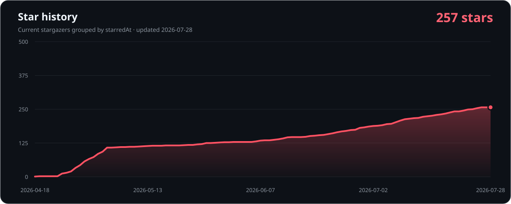

<p align="center">
  <a href="./README.md">繁體中文</a> · <strong>English</strong>
</p>

<h1 align="center">JableTV Downloader</h1>

<p align="center">
  Desktop downloading and category monitoring for JableTV, MissAV, and SupJav, with <strong>built-in AI subtitles</strong>.<br />
  <strong>Download the video, then automatically add AI subtitles:</strong> local Japanese speech transcription can create Japanese, English, and Traditional Chinese SRT files.<br />
  Use <strong>Modern</strong> to browse and pick videos, or <strong>SmallTool</strong> to keep watching selected feeds.
</p>

<p align="center">
  <a href="https://github.com/Alos21750/JableTV-MissAV-Downloader-GUI-2026/releases/latest"></a>
  <a href="https://github.com/Alos21750/JableTV-MissAV-Downloader-GUI-2026/releases"></a>
  <a href="https://github.com/Alos21750/JableTV-MissAV-Downloader-GUI-2026"></a>
  <a href="./LICENSE"></a>
  <a href="https://github.com/Alos21750/JableTV-MissAV-Downloader-GUI-2026/pkgs/container/jabletv"></a>
</p>

<p align="center">
  <strong><a href="https://github.com/Alos21750/JableTV-MissAV-Downloader-GUI-2026/releases/latest/download/JableTV_Modern.exe">Download Modern</a></strong>
  ·
  <strong><a href="https://github.com/Alos21750/JableTV-MissAV-Downloader-GUI-2026/releases/latest/download/Jable_smalltool.exe">Download SmallTool</a></strong>
  ·
  <a href="https://github.com/Alos21750/JableTV-MissAV-Downloader-GUI-2026/releases/latest">SmallTool portable ZIP (v2.5.38+)</a>
  ·
  <a href="https://github.com/Alos21750/JableTV-MissAV-Downloader-GUI-2026/releases/latest">View the latest release</a>
</p>

> [!TIP]
> **Fully local by default, with no API key and no uploads.** After a download, Modern and SmallTool can create selectable `.ja.srt`, `.en.srt`, and `.zh-TW.srt` sidecars without modifying the MP4. You can optionally connect a common LLM API; recognized subtitle text is then the only media-derived content sent, alongside required API authentication and ordinary connection metadata—never video or audio.

<p align="center">
  
</p>

## Pick the right tool

| What you want to do | Choose | Workflow |
|---|---|---|
| Browse, search, and pick individual videos | **JableTV_Modern.exe** | Browse cards, multi-select, queue, or download now |
| Follow new items from selected categories | **Jable_smalltool.exe** | Choose sites, categories, a date, and version priority, then monitor |
| Defender reports a detection on the one-file SmallTool | **Jable_smalltool_portable.zip** | Verify the hash and detection details before evaluating the fallback that does not temporarily self-extract; stop and report it if the fallback is also detected |
| Run headlessly on a NAS or server | **Docker / CLI** | Pass one or more URLs, or mount a `urls.txt` file |

If you are unsure, start with **Modern**. Both Windows executables are portable, need no Python installation, and include ffmpeg in the release build.

## Windows: start in 30 seconds

1. Download [JableTV_Modern.exe](https://github.com/Alos21750/JableTV-MissAV-Downloader-GUI-2026/releases/latest/download/JableTV_Modern.exe) or [Jable_smalltool.exe](https://github.com/Alos21750/JableTV-MissAV-Downloader-GUI-2026/releases/latest/download/Jable_smalltool.exe).
2. Put the file in a writable folder and double-click it.
3. Pick a language on first launch. You can later switch among English, 繁體中文, 简体中文, 日本語, plus light and dark themes.

SmartScreen reputation warnings and Defender Antivirus quarantine are different events. Read [Windows download and security verification](./WINDOWS_SECURITY.md) first: verify `SHA256SUMS.txt` and GitHub provenance, and do not weaken protection when Defender reports a threat name.

## Modern: browse, pick, download

1. Open Browse, choose JableTV, MissAV, or SupJav, then select a category or search.
2. Select multiple cards and add them to the queue, or download the selection immediately.
3. You can also paste URLs on the Download tab or import a `.txt` / `.csv` list.
4. Use Settings for the destination, quality, concurrency, speed limit, AI subtitles, and proxy.

| Capability | Current behavior |
|---|---|
| Download queue | Per-item state, progress, and speed; queue persistence; retry one failed item |
| Concurrency | 2 video downloads by default, up to 32; AI subtitles run in a separate background queue without occupying download slots |
| Quality preference | Highest, 1080p, 720p, 480p, 360p, or Lowest; actual variants depend on the source |
| AI subtitles | Off, Japanese, English, Traditional Chinese, or all three; translation is local by default, with an optional user-configured LLM API; output is selectable sidecar SRT files |
| URL input | Clipboard detection, manual paste, and text/CSV batch import |
| Proxy | Custom HTTP, HTTPS, SOCKS4, or SOCKS5, or the enabled Windows manual ProxyServer; no change to the Windows global proxy |
| Updates | Background GitHub Release check; the user confirms before installing an update |

## SmallTool: monitor categories automatically

<p align="center">
  
</p>

1. Choose a destination. If left unset, SmallTool creates `tmp` beside the executable.
2. Select Show settings to change the baseline date, quality, version priority, AI subtitles, and proxy. Collapse settings afterward to give categories the full window.
3. Search and select categories on any of the three site tabs; group-wide selection is available.
4. Select Schedule to check every 1–168 hours or once a day at a specified computer-local time.
5. Press Start Monitoring. Categories remain visible; progress appears only while work is active, and Show activity opens the log area when needed.

| Site | Selectable targets | Groups |
|---|---:|---|
| JableTV | 129 | Feeds/rankings, primary categories, and tag groups |
| MissAV | 102 | Feeds/rankings, categories/tags, and makers |
| SupJav | 10 | Feeds/rankings and primary categories |

SmallTool can check every 1–168 hours or once a day at a specified time using this computer's local time; existing settings continue to default to every 24 hours. Check Now runs one immediate check without creating another recurring schedule. When the same recognized title code appears across categories or sites, the candidate matching your selected version priority is kept. If a code cannot be identified reliably, only an identical URL is deduplicated—SmallTool does not guess.

State is stored in `.Jable_smalltool` beside the executable when writable, otherwise in `%APPDATA%\JableTV Downloader\smalltool`.

## AI subtitles: download first, get selectable Japanese, English, and Traditional Chinese SRTs

- Both Windows GUIs offer **Off / Japanese / English / Traditional Chinese / all three** before download. When a video finishes, the app creates only the selected `.ja.srt`, `.en.srt`, and/or `.zh-TW.srt` sidecars without modifying the MP4. If only English or Chinese is requested and translation fails, no unrequested Japanese sidecar is left behind. Subtitle translation defaults to the local mode, which requires no API key.
- Japanese transcription stays local and uses pinned releases of the official [whisper.cpp](https://github.com/ggml-org/whisper.cpp) and [official Silero VAD](https://huggingface.co/ggml-org/whisper-vad/tree/main). Three SHA-256-verified speech profiles download lazily only when selected: **Accurate (default), large-v3-turbo q5, ~574 MB**; **Balanced, small q5, ~190 MB**; and **Fast, base q5, ~60 MB**.
- External VAD is used only as a speech gate. Transcription runs on context-rich, non-overlapping windows that retain the original silence, then remaps cues to absolute video time. Decoding uses beam search, best-of candidates, and temperature fallback for stronger recognition and a stable timeline.
- The app records the recognition profile and pipeline provenance of subtitles it generates. A change to either retriggers app-generated recognition and derived translations, while pre-existing SRT files without provenance and user-edited SRT files are preserved unchanged.
- Local English and Taiwan Traditional Chinese translation uses pinned, SHA-256-verified [FuguMT](https://huggingface.co/staka/fugumt-ja-en) and [OPUS-MT](https://huggingface.co/Helsinki-NLP/opus-mt-en-zh) INT8 models. It does not use Google or another free network translation endpoint. The approximately **147 MB** local translation pack is downloaded only when an English, Traditional Chinese, or all-three subtitle job actually starts. Off and Japanese-only jobs do not download it, and an LLM API job does not need it. Once downloaded, the pack can be reused offline.
- Optional API extensions support the **OpenAI, Anthropic, Gemini**, and **OpenAI-compatible** APIs. The compatible option can connect to services such as DeepSeek, OpenRouter, Groq, Ollama, and LiteLLM. Recognized subtitle text is the only media-derived content sent to the selected service; required API authentication and ordinary connection metadata are also sent, while video and audio always remain local.
- User-supplied API keys are encrypted with Windows DPAPI for the current signed-in Windows account. No API key is bundled with the project or either EXE. Pricing, quotas, data handling, and acceptable-use policies depend on the chosen provider; check that provider's current terms before use.
- Local translation keeps every cue attached to its original timestamp and adds more than 900 maintainer-authored and reviewed adult-domain, safety/consent, filming-privacy, production-direction, and everyday phrases, plus conservative Taiwan wording and versioned exact-match translation memory. It deliberately avoids fuzzy matching that could invert meanings such as “stop” and “don’t stop.”
- Modern keeps video downloads and subtitle processing in separate queues, so background subtitle work does not occupy any of the 1–32 video download slots.
- Runtime depends on CPU, video length, the amount of speech, and the selected translation service. All-three mode reuses one local transcription pass; local mode also reuses intermediate translation output instead of repeating inference.

## Supported scope

| Site | Modern browse/search/download | SmallTool monitoring | Docker/CLI URL download |
|---|:---:|:---:|:---:|
| JableTV | ✓ | ✓ | ✓ |
| MissAV | ✓ | ✓ | ✓ |
| SupJav | ✓ | ✓ | ✓ |

Sites and CDNs can change without notice. If one stops working, update first, then open an Issue with reproducible details.

## Run from source

The current code requires **Python 3.10+** and Tk. The former Python 3.8+ README claim no longer matches syntax used by the project.

```bash
git clone https://github.com/Alos21750/JableTV-MissAV-Downloader-GUI-2026.git
cd JableTV-MissAV-Downloader-GUI-2026
python -m pip install -r requirements.txt

# Full GUI
python main.py

# Category monitor
python jable_smalltool.py

# One URL, no GUI, with an explicit output directory
python main.py --nogui --url "https://jable.tv/videos/example/" --output "/path/to/downloads"
```

`-o` is the short form of `--output`. If omitted, downloads are saved under
`./download`.

On Linux, install `python3-tk` with your system package manager if Tk is not already available. macOS and Linux run from source; the portable EXE release is for Windows.

## Docker / NAS

The public image is `ghcr.io/alos21750/jabletv:latest`. GitHub Actions builds both amd64 and arm64 variants.

```bash
# Download one URL; mount a host directory at /downloads
docker run --rm -v "/path/to/downloads:/downloads" \
  ghcr.io/alos21750/jabletv:latest "https://jable.tv/videos/example/"

# docker compose: pass a URL directly
docker compose run --rm jabletv "https://jable.tv/videos/example/"

# Or put one URL per line in ./downloads/urls.txt
docker compose run --rm jabletv
```

Environment variables:

| Variable | Purpose |
|---|---|
| `RESOLUTION` | `highest`, `1080`, `720`, `480`, `360`, or `lowest` |
| `URL` / `URLS` | Pass one or more URLs |
| `URLS_FILE` | URL list; defaults to `/downloads/urls.txt` |
| `DOWNLOAD_DIR` | Container destination; defaults to `/downloads` |

Docker is a headless, run-to-completion download job. It does not contain the Modern or SmallTool GUI.

## Troubleshooting

When opening a [GitHub Issue](https://github.com/Alos21750/JableTV-MissAV-Downloader-GUI-2026/issues/new), include:

- App version, selected tool, and operating system.
- Site and reproducible URL, plus expected and actual behavior.
- For a crash, attach `crash_log.txt` or `crash_native.log` from beside the executable.
- Never upload cookies, proxy credentials, tokens, or other private values.

If you need a proxy, choose a custom proxy, Windows system proxy, or Direct in Modern Settings or at the top of SmallTool. Both GUIs share the setting and it applies only to this application. Windows mode currently supports an enabled manual ProxyServer. A PAC configuration URL is reported but not executed; WPAD auto-detection is not yet supported.

## Stars and project activity

<p align="center">
  
</p>

The chart is generated by this repository's GitHub Actions workflow. It uses a read-only repository token to request only each current stargazer's `starredAt` timestamp; usernames are neither requested nor written. The file changes only when the data or chart format changes. The curve therefore represents join dates for accounts that currently still star the repository; removed stars are not included.

<details>
<summary>Why is the old api.star-history.com image no longer embedded?</summary>

GitHub restricted access to stargazer listings in July 2026, which broke the old anonymous Star History image endpoint. This repository now generates a static SVG with its own GitHub Actions permission, avoiding a broken README image without putting a token in the README. References: [GitHub announcement](https://github.blog/changelog/2026-06-30-upcoming-access-restrictions-to-public-api-endpoints-and-ui-views/) · [Star History explanation](https://www.star-history.com/blog/github-stargazer-api-restriction/)

</details>

## License and responsible use

Code is licensed under the [Apache License 2.0](./LICENSE). Use this tool only for lawful personal or research purposes. Follow local law, site terms, and content rights, and download only material you are authorized to access.

See [Releases](https://github.com/Alos21750/JableTV-MissAV-Downloader-GUI-2026/releases) for version notes and resolved issues.

<p align="center">Built and maintained by <a href="https://github.com/Alos21750">ALOS</a>.</p>
